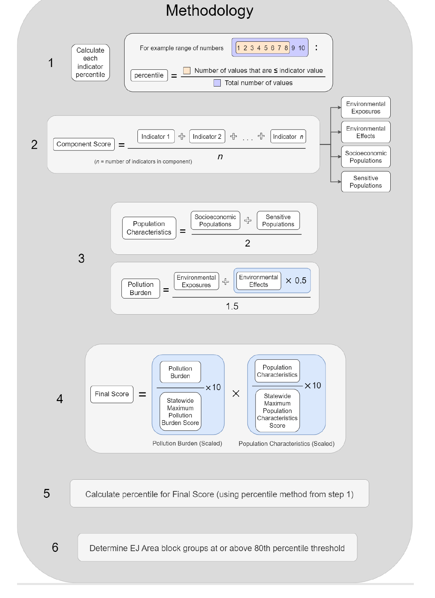

```{r setup, include=FALSE}
knitr::opts_chunk$set(echo = TRUE)
```

```{r import_libraries, include=FALSE, warning=FALSE, message=FALSE}
library(sf)
library(tidyverse)
library(grid)
library(gridExtra)
library(kableExtra)
library(tinytex)
```

```{r de_basins, echo = FALSE, results='hide'}

de_basin <- st_read('Data/DE_Basin.shp') %>%
  st_transform('ESRI:103515')

extent_basin = st_bbox(de_basin)
```

## Introduction

The Pennsylvania Department of Environmental Protection (DEP) adopted an interim Environmental Justice (EJ) Policy on September 16th, 2023. The new EJ Policy is currently available for public comments through November 30th 2023.

The launch of the new environmental policy was coupled with the release of a new improved environmental mapping tool called [PennEnviroScreen](https://gis.dep.pa.gov/PennEnviroScreen/). This tool was built to help both DEP and the general public identify EJ areas in Pennsylvania. The PennEnviroScreen platform identifies EJ Areas using the PennEnviroScreen score. PennEnviroScreen scores are calculated at the census block group level, and possible scores range from 1 to 100. Any census block which has a score greater than 80 is considered an environmental justice community according to the new policy. This memo provides a brief overview of how the PennEnviorScreen score is calculated, how the score relates to the new EJ mapping protocols, and provides an overview of how the new mapping of EJ areas differs from previous environmental justice mapping for Pennsylvania. More details on PennEnviroScreen are available in this [report](https://www.depgreenport.state.pa.us/elibrary/GetDocument?docId=5603905&DocName=PENNSYLVANIA%20ENVIRONMENTAL%20JUSTICE%20MAPPING%20AND%20SCREENING%20TOOL%20%28PENNENVIROSCREEN%29%20METHODOLOGY%20DOCUMENTATION%202023.PDF%20%20%3cspan%20style%3D%22color:green%3b%22%3eCOMMENTS%20DUE%20OCTOBER%2029%2c%202023%3c/span%3e%20%3cspan%20style%3D%22color:blue%3b%22%3e%28NEW%29%3c/span%3e) published by DEP.

## What components are considered in the PennEnviroScreen score calculation?

The PennEnviroScreen score is based on four different component scores:

* **Environmental Exposure**: Exposure to pollutants including air, water, and soil pollutants.
* **Environmental Effects**: Presence of infrastructure or sites which may cause pollution.
* **Sensitive Population**: Population health characteristics that result in increased vulnerability to environmental threats, such as having cancer, asthma, or a heart condition.
* **Socioeconomic Factors**: Factors pertaining to demographic and socio-economic status such as race, income levels, lack of education, and linguistic isolation (i.e: population that does not speak English).

Each component score is based on multiple indicators. In order for an indicator to be used in PennEnviroScreen the data for the indicator must be available at the census block group level. Additionally, the dataset must be available for the entire commonwealth of Pennsylvania and it must be updated at least once per year. DEP intends to update the indicators used in PennEnviroScreen once per year. This will allow up to date data on environmental justice areas to be considered by decision makers. Data layers in PennEnviroScreen will not always contain the most up to date data as some datasets are updated more than once per year by the data provider. 

### Elements factored into each score:

**The Environmental Exposure Component** includes the following indicators:

* Ozone Levels 
* Diesel Particulate Matter Level
* Toxic Air Emissions
* Toxic Water Emissions
* Pesticide Usage
* Traffic Density
* Compressor Stations
* Children Lead Risk

**The Environmental Effects Component** includes the following indicators:

* Number of fracking wells within 1km of census block
* Number of conventional oil and gas wells within 1km of census block
* Length or railroads within 1km of of census block
* Number of land remediation sites (i.e: superfund and brownfield sites) with 1km of census block
* Number of hazardous waste sites within 1km of census block
* Number of coal mining sites within 1km of census block
* Number of municipal waste sites within 1 km of census block
* Number of impaired water sites within 1 km of census block
* Number of abandoned mines with 1 km of census block


**The Sensitive Population Component** includes the following indicators:

* Percent of population with asthma
* Percent of population without health insurance
* Percent of population with cancer
* Percent of population that is disabled
* Percent of population with Coronary Heart Disease


**The Socioeconomic Component** includes the following indicators:

* Percent of population with a high school degree
* Percent of population who do not speak English
* Percent of population living in poverty
* Percent of population which is housing burdened (i.e: struggles to pay rent)
* Percent of population which are people of color (i.e: not white)
* Percent of population that is unemployed
* Percent of population over 64
* Percent of population under 5

## How is PennEnviroScreen score calculated? 

The process of calculating the PennEnviroScreen score based on individual indicators follows a six step process outlined below and is visualized in the provided graphic.

1. For each indicator, each block group is assigned a percentile (1-100) according its rank in the state wide distribution for the indicator.
2. The score for each component is calculated by averaging the percentiles for each indicator which is part of the component (e.g: The percentiles for all the indicators which are part of the socioeconomic components are averaged together).
3. A pollution characteristic score is calculated by averaging the environmental exposures and environmental effects components together. A population burden score is calculated by averaging the environmental exposures and environmental effects components together.  
4. The final score is calculated by first scaling the pollution burden and population characteristics scores to a 1 - 10 range and then multiplying the two scores together. Thus, the final PennEnviroScreen score will range from 1 to 100. 
5. The final score percentile is calculated for each block group based on the block group's rank in the statewide range of values.  
6. Any census block which has a final score percentile grater than the 80th percentile is considered an EJ community.

The methodology is also explained in the graphic below which was provided by DEP.

<center>
{width=300px, height=500px}
</center>

``` {r read_data, warning=FALSE, message=FALSE, include=FALSE}
EJ2023 <- st_read("https://gis.dep.pa.gov/depgisprd/rest/services/EnvironmentalJusticeAdvisoryBoard/EJACensusBlockGroups2023/MapServer/0/query?outFields=*&where=EJAREA%3D%27yes%27&f=geojson")

EJ2023 <- EJ2023 %>%
  st_transform('ESRI:103515') %>%
  st_make_valid() %>%
  mutate(YEAR = 2023,
         AREA = as.double(st_area(st_make_valid(EJ2023))/2.788e+7)) %>%
  dplyr::select(YEAR, AREA)

EJ2015 <- st_read("https://gis.dep.pa.gov/depgisprd/rest/services/EnvironmentalJusticeAdvisoryBoard/EJACensusTracts2015/MapServer/0/query?where=1=1&f=geojson")

EJ2015 <- EJ2015 %>%
  st_transform('ESRI:103515') %>%
  dplyr::mutate(YEAR = 2015,
                AREA = as.double(st_area(EJ2015)/2.788e+7)) %>%
  dplyr::select(YEAR,AREA)

bind <- rbind(EJ2023,EJ2015)

pa_counties <- st_read("https://gis.penndot.gov/gis/rest/services/opendata/countyboundary/MapServer/0/query?outFields=*&where=1%3D1&f=geojson") %>%
  st_transform('ESRI:103515')
``` 

## What are the differences between the new and old EJ mapping protocols?

The old EJ Mapping protocols from 2015 only considered socioeconomic factors in the EJ area definition. Any census block in which 20% of the population lived in poverty and/or 30% of the population identified as a minority was considered an EJ area. The new mapping protocol considers environmental exposure, environmental effects, and sensitive populations factors in addition to socioeconomic factors.

The map below provide a visual overview of EJ Areas using the 2015 and 2023 definitions. Notable areas where there has been a reduction in the number of census blocks identified as EJ areas include Monroe and Pike counties in Northeast PA, Chester county in southeast PA, and forest county. The counties where the number of census blocks classified as EJ areas has increased are mainly clustered in Southwest PA where large oil, coal, and natural gas mining operations are present.

```{r make_maps, fig.width=10, fig.height=4, echo = FALSE}
map1 <- ggplot()+
  geom_sf(data=pa_counties, fill='grey90')+
  geom_sf(data=bind, fill='green',color='transparent')+
  geom_sf(data=pa_counties, color='grey60',fill='transparent',linewidth=0.3)+
  facet_wrap(~YEAR)+
  geom_sf_text(data=pa_counties,aes(label=COUNTY_NAME),size=2)+
  ggtitle('EJ Communities based on 2015 and 2023 Defintions')+
  theme_light()+
  theme(axis.text=element_blank(), 
      axis.ticks=element_blank(),
      axis.title=element_blank(),
      panel.grid=element_blank()) 

map1 
```

This map below shows areas identified as EJ Areas according to both the 2023 and 2015 definitions and areas identified as EJ communities according to just the 2023 definition and just the 2015 definition. We can again observe that there are a significant number of census blocks which are no longer classified as EJ communities. This includes parts of Philadelphia. Lancaster county also includes many new EJ Areas according to the 2023 definition.

```{r intersection_work, fig.width=11,fig.height=6,warning=FALSE, echo = FALSE}

intersection <- st_intersection(EJ2015, EJ2023)
only2015 <- st_difference(EJ2015,st_union(EJ2023))
only2023 <- st_difference(EJ2023,st_union(EJ2015))

intersection_basin <- st_intersection(pa_counties,de_basin)
extent_basin_pa <- st_bbox(intersection_basin)

extent_pa = st_bbox(pa_counties)

ggplot()+
  geom_sf(data=pa_counties, fill='grey90')+
  geom_sf(data=only2015,aes(fill='2015 only'),color='transparent')+
  geom_sf(data=only2023,aes(fill='2023 only'),color='transparent')+
  geom_sf(data=intersection,aes(fill='2023 & 2015'),color='transparent')+
  geom_sf(data=pa_counties, color='grey60',fill='transparent',linewidth=0.3)+
  scale_fill_manual(values=c('#fdc086','#beaed4','#7fc97f'),name='EJ Area')+
  geom_sf(data=de_basin, color='#71b7fc',linewidth=0.5, fill='transparent')+
  geom_sf_text(data=pa_counties,aes(label=COUNTY_NAME),size=2)+
  scale_x_continuous(limits = c(extent_pa$xmin, extent_pa$xmax)) +
  scale_y_continuous(limits = c(extent_pa$ymin, extent_pa$ymax))+
  ggtitle('Areas identified as EJ Communities According to the 2015 and 2023 EJ Definitions',subtitle='Blue line represents Delaware River Basin Boundary')+
  theme_light()+
  theme(axis.text=element_blank(), 
      axis.ticks=element_blank(),
      axis.title=element_blank(),
      panel.grid=element_blank()) 
```
\newpage

## Difference in area classified as EJ Communities

The table below shows the area classified as an Environmental Justice Area according to the 2015 and 2023 EJ definitions. Overall, the area classified as an EJ Area has increased with the adoption of the new EJ policy protocols.

```{r area_analysis, echo = FALSE}

bind %>%
  st_drop_geometry() %>%
  group_by(YEAR) %>% summarize(total_area = sum(AREA)) %>%
  kbl(col.names=c('Year','Area classified \n as Enviormental Justice Area (square miles)')) %>%
  kable_styling(latex_options='hold_position') %>%
  kable_classic()
```

## What does the map of EJ communities in the Delaware Basin look like?

The maps below show communities in the Delaware river basin that were classified as EJ communities according to the 2015 EJ definition and the new 2023 EJ community definition. The third map shows areas identified as EJ Areas according to both the 2023 and 2015 definitions and areas identified as EJ communities according to just the 2023 definition and just the 2015 definition.

```{r de_basins_map1, echo = FALSE, fig.width=7, fig.height=5, warning=FALSE, message=FALSE}
grid.arrange(nrow=1,ncol=3,
ggplot()+
  geom_sf(data=pa_counties, fill='grey90')+
  geom_sf(data=EJ2015, fill='green',color='transparent')+
  geom_sf(data=pa_counties, color='grey60',fill='transparent',linewidth=0.3)+
  geom_sf(data=de_basin, color='#71b7fc',linewidth=0.5, fill='transparent')+
  scale_x_continuous(limits = c(extent_basin$xmin, extent_pa$xmax)) +
  scale_y_continuous(limits = c(extent_pa$ymin, extent_basin_pa$ymax))+
  geom_sf_text(data=pa_counties,aes(label=COUNTY_NAME),size=2)+
  ggtitle('2015 EJ Communities')+
  theme_light()+
  theme(axis.text=element_blank(), 
      axis.ticks=element_blank(),
      axis.title=element_blank(),
      panel.grid=element_blank()),

ggplot()+
  geom_sf(data=pa_counties, fill='grey90')+
  geom_sf(data=EJ2023, fill='green',color='transparent')+
  geom_sf(data=pa_counties, color='grey60',fill='transparent',linewidth=0.3)+
  geom_sf(data=de_basin, color='#71b7fc',linewidth=0.5, fill='transparent')+
  scale_x_continuous(limits = c(extent_basin$xmin, extent_pa$xmax)) +
  scale_y_continuous(limits = c(extent_pa$ymin, extent_basin_pa$ymax))+
  geom_sf_text(data=pa_counties,aes(label=COUNTY_NAME),size=2)+
  ggtitle('2023 EJ Communities')+
  theme_light()+
  theme(axis.text=element_blank(), 
      axis.ticks=element_blank(),
      axis.title=element_blank(),
      panel.grid=element_blank()),

ggplot()+
  geom_sf(data=pa_counties, fill='grey90')+
  geom_sf(data=only2015,aes(fill='2015 only'),color='transparent')+
  geom_sf(data=only2023,aes(fill='2023 only'),color='transparent')+
  geom_sf(data=intersection,aes(fill='2023 & 2015'),color='transparent')+
  geom_sf(data=pa_counties, color='grey60',fill='transparent',linewidth=0.3)+
  scale_fill_manual(values=c('#fdc086','#beaed4','#7fc97f'),name='EJ Area')+
  geom_sf(data=de_basin, color='#71b7fc',linewidth=0.5, fill='transparent')+
  scale_x_continuous(limits = c(extent_basin$xmin, extent_pa$xmax)) +
  scale_y_continuous(limits = c(extent_pa$ymin, extent_basin_pa$ymax))+
  geom_sf_text(data=pa_counties,aes(label=COUNTY_NAME),size=2)+
  ggtitle('2015 / 2023 Comparision')+
  theme_light()+
  theme(axis.text=element_blank(), 
      axis.ticks=element_blank(),
      axis.title=element_blank(),
      panel.grid=element_blank(),
      legend.position = c(.01, .99),
      legend.justification = c("left", "top"),
      legend.box.just = "left",
      legend.margin = margin(2, 2, 2, 2))
)

```

## How was PennEnviroScreen Methodology Developed?

The PennEnviroScreen methodology was developed based on a review of platforms and EJ mapping protocols used by different federal and state agencies. The federal government has a platform for EJ Screening, but its utility for decision making is limited because it does not present a single consolidated EJ score. DEP wanted to have a single score in order to allow policy makers and project managers to be able to quickly determine where EJ Policies should apply. The PennEnviroScreen methodology is based on the methodology used in California for [CalEnviorScreen 4.0](https://experience.arcgis.com/experience/11d2f52282a54ceebcac7428e6184203/page/CalEnviroScreen-4_0/)

## What are some of caveats to keep in mind when using the new EJ Mapping?

It is important to note that PennEnviroScreen score is based on multiple different environmental hazards. Project managers who are interested in understanding a specific type of hazard (i.e: water pollution) might want to look at the information for the specific indicators related to water pollution instead of looking at the consolidated PennEnvrioScreen score. The PennEnviroScreen Tool conveniently provides access to data on all indicators which are used as inputs to the PennEnviroScreen score. 

It is important to note that the PennEnviroScreen score methodology relies on percentiles. Each census block is compared to the rest of the census blocks in the state. This means that some blocks will always be assigned high percentile values, even if they meet regulatory standards. Additionally, because of the 80 percentile rule which is used to identify EJ Areas, 20% of census blocks will always be identified as EJ Area even if the presence of environmental hazards declines statewide. 
